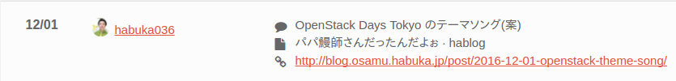
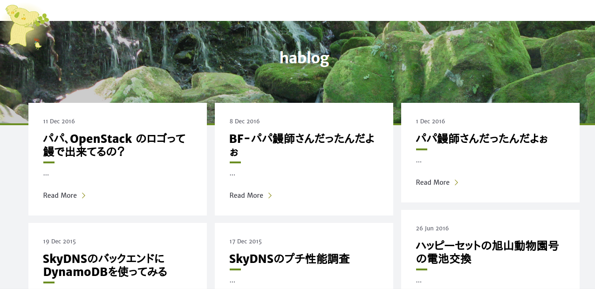
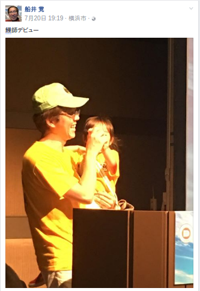
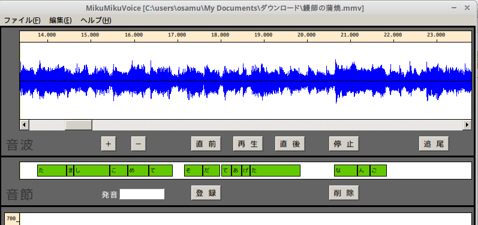

# パパ鰻師さんだったんだよぉ

日本鰻師同好会

羽深 修

@habuka036

---
## 私は誰？

* 名前: 羽深 修 (はぶか おさむ)
* 所属
  * 日本Eucalyptusユーザ会  
  * 日本Henchman使ってみる会
  * 日本goss使ってみる会
  * 日本fission使ってみる会

---
## 今日のメニュー

---
## ノーアイデア

---
## これは何？

---
## 自分でもよくわかりません

---
## はっきり言って

---
# どうしてこうなった？

---
## ことの発端

* OpenStack AdventCalendar 2016 での話
* 2015年の同Calendarではエントリーの集りが悪かった
* そうだ！ここはOpenStack**ではない**自分が先陣を切ろう
* 非技術的な話題をポストすることで敷居を下げよう！

* 参考URL: https://adventar.org/calendars/1739

---
## 結果こうなった…

* 参考URL: http://blog.osamu.habuka.jp/post/2016-12-01-openstack-theme-song/

敷居を下げた結果、「初日からなんてことしてくれたんだ…」というお褒めの言葉多数…

---
## 調子に乗って他の日もエントリーしてしまった結果…

---

---
## そして大の大人達がこのバカを増長させた結果…

---

OpenStack Days Tokyo の LT で歌うハメに…

LT で歌うとか意味わかんない…

---
## そして大の大人達がこのバカを増長させた結果… パート2

---
# 今日ここに至ります

---
# ほんとスマン

---
## 冒頭で「ノーアイデア」と書きましたが…

---
## 本当は次のようなボツネタがあります…

---
## ボツネタその1: 鰻をここで焼く

* 間違いなく宮原さんが困ったことになる
* 日本工学院専門学校さんにも迷惑をかけてしまう
* そしてぼくは鰻を焼けない

---
## ボツネタその2: OpenStack Days Tokyo のときみたいに歌う

* ちょっと待って!ぼく音痴。そしてジャイアンボイス。
* 前回と同じネタをやるのは心が折れる
* (みなさんが)酒を飲んでない

---
## ボツネタその3: Vocaroid に歌わせる

* Vocaroid 使ったことないし、知識もない
* MikuMikuVoice で楽をしようと試みたが…

---
## ボツネタその4: 鰻師の蒲焼のPVを一人芝居で演じる

* …ムリ

---
## ボツネタその5: OpenStack の LiveDVD を作って配る

* OpenStack の構築をして成功したことがほとんどない

---
## ボツネタそのX

* みんなに日本鰻師同好会のTシャツを配る
  * 予算なし
* 「ニホンウナギが絶滅しそうなので自粛します」と言って逃亡する
  * 宮原さんに怒られる
* 鰻の話を真面目にする
  * 資料が間にあいませんでした…orz

---
## 残った案

### 今日参加してくださったみんなでパロPVを作る

---
## パロPVを作る

### 賛同してくださる方は @habuka036 にツブやいてください

---
# 最後に

---
# ほんとスマン
